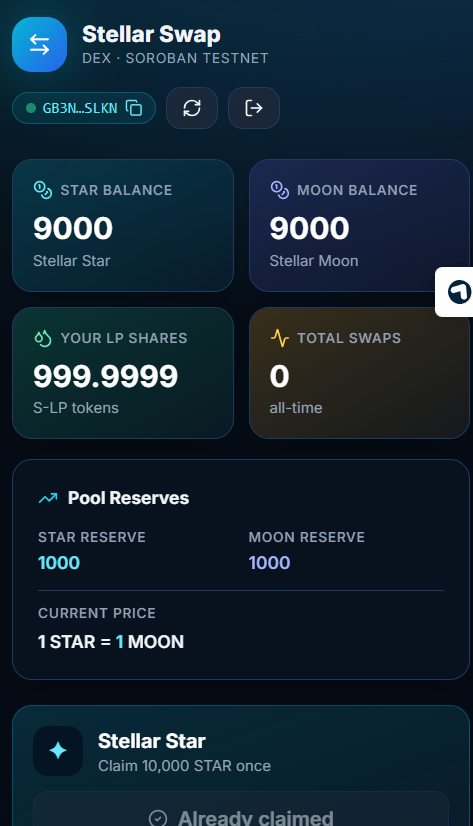

# 🌊 Stellar Swap — Green Belt

[](https://stellar-swap.onrender.com)

[](https://github.com/orenzoaniels-sys/stellar-swap/actions/workflows/ci.yml)
[](https://stellar.expert/explorer/testnet)
[](#-tests)
[](#-architecture-inter-contract-calls)
[](#-license)

A **4-contract constant-product AMM** (Uniswap-V2 style) on Stellar Soroban. Two fungible tokens (`STAR` + `MOON`), an LP-share token, and the AMM pool itself — with **3 inter-contract calls per `add_liquidity()` / `remove_liquidity()`** and **2 per `swap()`**.

> **Stellar Frontend Challenge — Level 4 (Green Belt) submission.**
> No NFTs, no minting UI — this project focuses on **DeFi primitives**: pricing curves, LP shares, slippage, and atomic multi-contract settlement.

**🌐 Try it now → https://stellar-swap.onrender.com**

---

## 🎯 What it does

Users claim free **STAR** and **MOON** tokens from two per-wallet faucets, seed a pool by **adding liquidity** (which mints them LP-shares representing their pool ownership), **swap** between STAR and MOON against the pool, or **remove** their liquidity at any time to reclaim their proportional share of the reserves — including accumulated swap fees.

Every swap charges a **0.30% fee** that stays in the pool, growing the `k` invariant and rewarding liquidity providers. The UI quotes the exact output amount via an on-chain `quote_swap()` simulation before the user signs, shows the **price impact**, and lets the user configure a slippage tolerance (0.1 / 0.5 / 1 % presets + custom).

---

## 🚀 Live deployment (testnet)

| Contract           | Address | Explorer |
| ------------------ | ------- | -------- |
| **Token A** (STAR) | `CCPAKYVGG4LRFSAIC2FKEHVIXJNAQ7AACA6YDEWGXLREN3ZBDPZTGOXK` | [view](https://stellar.expert/explorer/testnet/contract/CCPAKYVGG4LRFSAIC2FKEHVIXJNAQ7AACA6YDEWGXLREN3ZBDPZTGOXK) |
| **Token B** (MOON) | `CBYE3TO3RE4GQO26MJX7V5U5YFQO3CCO4MQUQV2IX7DQZLI3BMU2CDLS` | [view](https://stellar.expert/explorer/testnet/contract/CBYE3TO3RE4GQO26MJX7V5U5YFQO3CCO4MQUQV2IX7DQZLI3BMU2CDLS) |
| **LP token** (S-LP) | `CCY6RWSDVDEXT6CZVD5YMBJR7XVFPBK7SP2JK7HO5X575DIQRG5H2BE2` | [view](https://stellar.expert/explorer/testnet/contract/CCY6RWSDVDEXT6CZVD5YMBJR7XVFPBK7SP2JK7HO5X575DIQRG5H2BE2) |
| **AMM**            | `CADYO3ZF4YPNCMQECZ3MTLTQOAEZVJ54RDPQNZLQBC7H5LR3O7HUIZR6` | [view](https://stellar.expert/explorer/testnet/contract/CADYO3ZF4YPNCMQECZ3MTLTQOAEZVJ54RDPQNZLQBC7H5LR3O7HUIZR6) |

> The deploy script (`scripts/deploy.ps1`) prints these IDs and writes them to `.env.local` automatically.

---

## ✨ Features

- 💧 **Two independent faucets** — 10,000 STAR + 10,000 MOON per wallet, one-time each
- 🔗 **3 inter-contract calls** per liquidity op (pull token A, pull token B, mint/burn LP)
- 🔗 **2 inter-contract calls** per swap (pull in, send out — atomic)
- 📐 **Constant-product AMM** (`x · y = k`) with a **0.30 % pool fee**
- 🎟️ **LP-share token** mintable / burnable **only by the AMM** (enforced at `require_auth`)
- 🧮 **On-chain `quote_swap()`** used by the UI for real-time output previews
- 🎚️ **Slippage tolerance** control (0.1 / 0.5 / 1 % + custom)
- 📊 **Price impact indicator** (green / amber / rose) + **pool ratio guard** on deposits (1 % tolerance)
- 🪪 **Multi-wallet** via StellarWalletsKit (Freighter, xBull, Albedo, Lobstr, Hana)
- 📱 **Mobile responsive** — collapses to a single column on phones, tap-friendly controls
- 🛡️ **15 contract error variants** mapped to friendly UI messages
- ✅ **31 unit tests** (8 token + 7 lp_token + 16 AMM with cross-contract scenarios)
- 🤖 **GitHub Actions CI** — `cargo test --workspace` + `tsc --noEmit` + `vite build` on every push
- 🛰️ **Stellar Expert tx links** on every transaction toast

---

## 🧪 Tests

```bash
cd contracts && cargo test --workspace
```

```
running 8 tests (token)
test test::init_metadata                  ok
test test::double_init_rejected           ok
test test::admin_mint_and_balance         ok
test test::faucet_grants_amount_once      ok
test test::faucet_double_claim_rejected   ok
test test::transfer_moves_balance         ok
test test::transfer_insufficient_rejected ok
test test::negative_amount_rejected       ok
test result: ok. 8 passed

running 7 tests (lp_token)
test test::init_ok                        ok
test test::double_init_rejected           ok
test test::admin_mint_increases_supply    ok
test test::admin_burn_decreases_supply    ok
test test::burn_insufficient_rejected     ok
test test::transfer_works                 ok
test test::invalid_amount_rejected        ok
test result: ok. 7 passed

running 16 tests (amm — real cross-contract scenarios)
test test::init_stores_addresses                      ok
test test::double_init_rejected                       ok
test test::add_liquidity_initial_mints_shares         ok  ← 3 inter-contract calls
test test::add_liquidity_unbalanced_rejected          ok
test test::add_liquidity_invalid_amount_rejected      ok
test test::second_provider_gets_proportional_shares   ok
test test::swap_a_to_b_updates_reserves_and_pays_user ok  ← 2 inter-contract calls
test test::swap_b_to_a_works                          ok
test test::swap_slippage_exceeded_rejected            ok
test test::swap_empty_pool_rejected                   ok
test test::quote_swap_matches_actual                  ok
test test::remove_liquidity_returns_proportional      ok  ← 3 inter-contract calls
test test::remove_liquidity_invalid_amount_rejected   ok
test test::remove_liquidity_empty_pool_rejected       ok
test test::k_invariant_grows_after_swap_due_to_fee    ok
test test::fee_admin_unchanged                        ok
test result: ok. 16 passed

Total: 31 passing
```

The AMM tests deploy **real** `token` and `lp_token` contracts inside the same `Env`, then exercise the AMM against them — so every cross-contract call is verified end-to-end, not mocked.

---

## 🧰 Tech stack

| Layer       | Tech |
| ----------- | ---- |
| Contracts   | Rust + `soroban-sdk` 22 (workspace, 3 members) |
| Frontend    | React 18 + Vite 6 + TypeScript |
| Styling     | TailwindCSS (mobile-first) + Lucide icons |
| Wallets     | StellarWalletsKit (Freighter / xBull / Albedo / Lobstr / Hana) |
| Stellar SDK | `@stellar/stellar-sdk` 14 (Protocol 23) |
| CI          | GitHub Actions (Rust + Node) |

---

## 📁 Structure

```
stellar-swap/
├── contracts/
│   ├── token/           # STAR / MOON fungible token + per-wallet faucet
│   ├── lp_token/        # S-LP share token — only AMM can mint / burn
│   └── amm/             # Constant-product pool (x·y=k, 0.3% fee)
├── src/
│   ├── components/
│   │   ├── WalletBar.tsx      # Connect / switch / disconnect
│   │   ├── PoolStats.tsx      # Balances, reserves, price, total swaps
│   │   ├── FaucetCards.tsx    # STAR + MOON claim tiles
│   │   ├── SwapCard.tsx       # Input/output + slippage + price impact
│   │   └── LiquidityCard.tsx  # Add / remove tabs, ratio auto-balance
│   ├── lib/
│   │   ├── config.ts    # Env-driven contract IDs + token metadata
│   │   ├── wallet.ts    # StellarWalletsKit integration + signing
│   │   ├── stellar.ts   # Soroban RPC: simulate + sendTx + typed wrappers
│   │   ├── format.ts    # i128 ↔ human, address shortener, price math
│   │   ├── errors.ts    # Contract error codes → friendly UI text
│   │   └── toast.tsx    # Success / error / loading toasts with tx links
│   ├── App.tsx
│   ├── main.tsx
│   └── index.css
├── scripts/
│   └── deploy.ps1       # Deploys + inits all 4 contracts in one shot
├── .github/workflows/ci.yml
├── render.yaml          # Render Blueprint
├── netlify.toml         # Netlify config (alt deploy)
└── README.md
```

---

## 🛠️ Setup

### Prerequisites
- Node 20+
- Rust + `wasm32v1-none` target
- Stellar CLI ≥ 22
- A wallet extension (Freighter recommended) on **testnet**

### Run locally
```bash
git clone <your-repo-url>
cd stellar-swap
npm install

# 1) Deploy + initialize all 4 contracts on testnet (one shot)
pwsh ./scripts/deploy.ps1

# 2) Start the dev server (env vars are auto-written to .env.local)
npm run dev
```

Open http://localhost:5181.

### Manual deploy (if you don't have PowerShell)

```bash
cd contracts && stellar contract build && cd ..
WASM=target/wasm32v1-none/release
ADMIN=$(stellar keys address alice)

# 1) Token A (STAR)
STAR=$(stellar contract deploy --wasm $WASM/token.wasm --source alice --network testnet)
stellar contract invoke --id $STAR --source alice --network testnet -- init \
  --admin $ADMIN --decimals 7 --name '"Stellar Star"' --symbol '"STAR"'

# 2) Token B (MOON)
MOON=$(stellar contract deploy --wasm $WASM/token.wasm --source alice --network testnet)
stellar contract invoke --id $MOON --source alice --network testnet -- init \
  --admin $ADMIN --decimals 7 --name '"Stellar Moon"' --symbol '"MOON"'

# 3) AMM (deploy BEFORE LP so LP admin = AMM address)
AMM=$(stellar contract deploy --wasm $WASM/amm.wasm --source alice --network testnet)

# 4) LP token — admin is the AMM contract, so ONLY it can mint/burn
LP=$(stellar contract deploy --wasm $WASM/lp_token.wasm --source alice --network testnet)
stellar contract invoke --id $LP --source alice --network testnet -- init \
  --admin $AMM --decimals 7 --name '"STAR-MOON LP"' --symbol '"S-LP"'

# 5) Wire the AMM
stellar contract invoke --id $AMM --source alice --network testnet -- init \
  --token_a $STAR --token_b $MOON --lp_token $LP
```

---

## 🚀 Deploy your own (Render)

The repo ships a `render.yaml` Blueprint:

1. Fork this repo on GitHub.
2. Open https://dashboard.render.com → **New +** → **Static Site** → connect your fork.
3. Use these settings:

   | Field | Value |
   | --- | --- |
   | Name | `stellar-swap` |
   | Branch | `main` |
   | Build Command | `npm install --no-audit --no-fund && npm run build` |
   | Publish Directory | `dist` |

4. Add env vars (paste IDs from `scripts/deploy.ps1` output):

   ```
   NODE_VERSION=20
   VITE_NETWORK_PASSPHRASE=Test SDF Network ; September 2015
   VITE_RPC_URL=https://soroban-testnet.stellar.org
   VITE_TOKEN_A_ID=…
   VITE_TOKEN_B_ID=…
   VITE_LP_TOKEN_ID=…
   VITE_AMM_ID=…
   ```

5. Hit **Create Static Site**. Done in ~2 min.

---

## 🧠 Architecture: inter-contract calls

The AMM defines two minimal client traits via `#[contractclient]` so the Soroban host can invoke both token contracts and the LP contract from inside a single pool operation:

```rust
#[contractclient(name = "TokenClient")]
pub trait TokenInterface {
    fn balance(env: Env, id: Address) -> i128;
    fn transfer(env: Env, from: Address, to: Address, amount: i128);
}

#[contractclient(name = "LpClient")]
pub trait LpInterface {
    fn balance(env: Env, id: Address) -> i128;
    fn total_supply(env: Env) -> i128;
    fn mint(env: Env, to: Address, amount: i128);
    fn burn(env: Env, from: Address, amount: i128);
}
```

### `add_liquidity()` — 3 cross-contract calls

```rust
token_a.transfer(provider, amm, amount_a);  // call #1
token_b.transfer(provider, amm, amount_b);  // call #2
lp.mint(provider, shares);                  // call #3  (only AMM can mint)
```

For the very first deposit, `shares = sqrt(a · b) − MIN_LIQUIDITY` (the
Uniswap-V2 dust-lock trick). Every subsequent deposit must match the
pool ratio within 1 %, and yields `min(a · L / reserve_a, b · L / reserve_b)`
new LP shares.

### `swap()` — 2 cross-contract calls

```rust
// output = (in · 9970 · out_reserve) / (in_reserve · 10000 + in · 9970)
token_in.transfer(user, amm, amount_in);    // call #1
token_out.transfer(amm, user, amount_out);  // call #2
```

The fee stays in the pool, so `k` strictly grows after every swap — this is the LP's yield. Reverts if `amount_out < min_out` (slippage guard).

### `remove_liquidity()` — 3 cross-contract calls

```rust
lp.burn(provider, shares);                    // call #1
token_a.transfer(amm, provider, amount_a);    // call #2
token_b.transfer(amm, provider, amount_b);    // call #3
```

Amounts are proportional to `shares / lp_total_supply`, so providers
always reclaim their slice of both reserves — including accumulated swap
fees.

### Why this is safe

The user signs **one** transaction; Soroban's auth framework propagates
`require_auth()` automatically down the call stack. The LP token hard-codes
`admin = AMM` at init, so **no external caller can mint or burn LP shares**
— only the AMM's own logic can, and only inside a liquidity op.

---

## 🔐 Error model

Every error returned by a contract is mapped to a human-readable
message in `src/lib/errors.ts`:

| Code | Meaning |
| ---- | ------- |
| `AlreadyInitialized (1)` | Pool / token already initialized |
| `NotInitialized (2)` | `init()` was never called |
| `InvalidAmount (3)` | Amount must be positive |
| `InsufficientLiquidity (4)` | Pool can't service the trade |
| `SlippageExceeded (5)` | Output below `min_out` — raise tolerance |
| `PoolEmpty (6)` | No reserves — deposit first |
| `Overflow (7)` | Arithmetic overflow |
| `UnbalancedDeposit (8)` | Ratio off by > 1 % vs pool |

Wallet-popup cancellations are also caught and silently ignored.

---

## 📸 Screenshots

### CI/CD pipeline


The CI badge above is live — it goes green when all three jobs (`Build + Test contracts`, `Build frontend`, `Status`) succeed on `main`.

### Mobile responsive

Open the live demo on a phone (or Chrome DevTools → mobile mode 375 × 667). The layout collapses to a single column, cards stack, the swap flip button stays reachable, and all buttons remain tap-friendly.



---

## ✅ Submission checklist (Green Belt)

- [x] **4 deployed contracts** (token · token · lp_token · amm)
- [x] **3 inter-contract calls** per `add_liquidity` / `remove_liquidity`, **2** per `swap`
- [x] **31 unit tests passing** (8 token + 7 lp_token + 16 AMM)
- [x] **8 contract error variants** on the AMM alone, all mapped to UI
- [x] Multi-wallet support + switch-account button
- [x] **Open faucets** for both pool tokens (custom mechanic, one-time per wallet)
- [x] **Constant-product pricing** with 0.30 % fee, quote + slippage controls
- [x] **Mobile-responsive UI** (Tailwind mobile-first, edge-to-edge)
- [x] Comprehensive README with badges, architecture, and tx hashes
- [x] **GitHub Actions CI** (cargo test + frontend build + dist artifact)
- [x] **Render Blueprint** (`render.yaml`) + Netlify config for one-click deploy
- [x] **Live deploy URL: https://stellar-swap.onrender.com**

---

## 📜 License

MIT © orenzoaniels-sys
